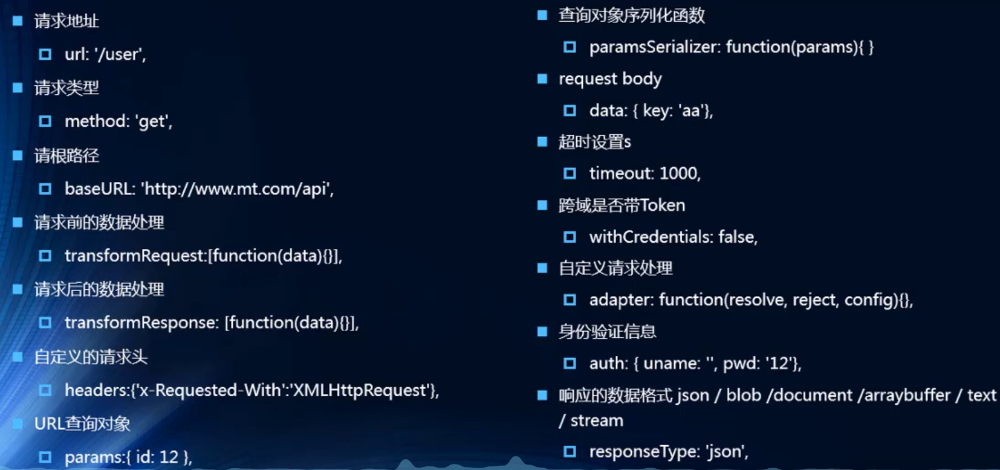

# axios的使用.

## axios的基本使用:
- #### 首先用npm指令导入axios包:
`npm install axios --save`
- #### 导入并且执行:

```js
//导入axios
import axios from 'axios'
...
axios({
  url:'http://123.207.32.32:8000/home/multidata'
}).then((res)=>{
  //axios本身可以返回一个Promise,所以我们直接再then()中写请求成功之后处理的事件
  console.log(res);
})

axios({
  url:'http://123.207.32.32:8000/home/data',
  params:{
    //当url中有参数的时候我们可以直接写在params属性中
    type:'pop',
    page:1
  }
}).then(res=>{
  console.log(res);
})
```

## axios.all的使用:
- #### axios.all使用方法:

```js
//传入参数为axios数组,请求成功调用then方法
axios.all([
  axios({
  url:'http://123.207.32.32:8000/home/multidata'
  }),
  axios({
    url:'http://123.207.32.32:8000/home/data',
    params:{
      type:'pop',
      page:1
  }})
]).then(results =>{
  //results返回的是所有请求的返回结果
  console.log(results);
})
```

## axios的相关配置:
- #### 配置的使用方法:

```js
//axios.defaults.xxxxx设置axios的全局配置
axios.defaults.baseURL = 'http://123.207.32.32:8000'
axios.defaults.timeout = 5000

axios.all([
    axios({
    url:'/home/multidata'
    }),
    axios({
      url:'/home/data',
      params:{
        type:'pop',
        page:1
    }})
  ]).then(results =>{
    //results返回的是所有请求的返回结果
    console.log(results);
  })
```

- #### 剩下的相关配置:


## axios拦截器的使用:
- #### 拦截器可以拦截请求与响应, 然后可以对他们做完相应的处理在放行(预处理).
- #### 以下演示的是全局的使用,实例的使用也类似(xxxxx.interceptors.request.use()).

```js
//设置请求拦截
axios.interceptors.request.use(res => {
  //处理发送请求
  console.log(res)
  //处理完毕记得返回,要不然发送不了请求
  return res
},err => {
  console.log(err)
})
//设置响应拦截
axios.interceptors.response.use(res => {
  //处理收到数据
  console.log(res)
  //处理完毕记得返回,要不然接收不到数据
  return res
},err => {
  console.log(err);
})

//发送请求
axios({
  url:'http://123.207.32.32:8000/home/multidata'
})
```

## 关于自己封装第三方引用的方式:
- #### 由于使用第三方组件的时候,会由于例如第三方组件突然不维护之类的问题需要淘汰第三方组件，这时候我们就需要自己封装第三方组件，这样会让替换第三方组建的时候不是那么繁琐。
- #### 一般由两种方法封装，一个是非强制与强制传入参数(这里以封装axios作为示例):

```js
import axios from 'axios'

//第一种封装方式
// export function request(config,success,failure){
//     //创建axios实例
//     const instance = axios.create({
//         baseURL:'http://123.207.32.32:8000',
//         timeout:5000
//     })
//     instance(config).then(res => {
//         success(res)
//     }).catch(err => {
//         failure(err)
//     })
// }

//第二种封装方式,强制传入success与failuer
export function request(config){
    const instance = axios.create({
        baseURL:'http://123.207.32.32:8000',
        timeout:5000
    })
    instance(config.baseConfig).then(res => {
        config.success(res)
    }).catch(err => {
        config.failure(err)
    })
}
```

- #### 使用:

```js
import {request} from './network/request'
//第一种封装方式
// export function request(config,success,failure){
//     const instance = axios.create({
//         baseURL:'http://123.207.32.32:8000',
//         timeout:5000
//     })
//     instance(config).then(res => {
//         success(res)
//     }).catch(err => {
//         failure(err)
//     })
// }

//第二种封装方式,强制传入success与failuer
export function request(config){
    const instance = axios.create({
        baseURL:'http://123.207.32.32:8000',
        timeout:5000
    })
    instance(config.baseConfig).then(res => {
        config.success(res)
    }).catch(err => {
        config.failure(err)
    })
}
```