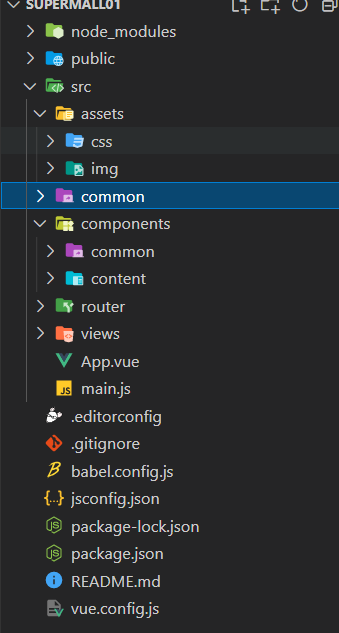

## 项目的目录结构:

### node_modules:保存npm安装之后的插件.
----------------

### public:公开的文件(公共资源文件)
----------------

### src目录下的文件夹:

- #### assets:用来保存资源文件.

- #### common:用来保存一些抽离出来的公共代码.

- #### components:用来保存组件.
> - components/common:用来保存公共组件.
> - components/content:用来保存业务相关的组件.

- #### router:用来保存路由相关的文件.

- #### views:用来保存界面.

- #### main.js:程序的入口.

- #### App.vue:最上层的根组件.
----------------

### .edlitorconfig:代码规范.
----------------

### .gitgnore:上传git时的相关设置.
----------------

### babel.config.js:让语法向下兼容,将ES6语法转换为ES5.
----------------

### package-lock.json:就是锁定安装时的包的版本号的文件.
----------------

### package.json:项目清单, 管理各种模块.
----------------

### README.md:描述项目的文件.
----------------

### vue.config.js:脚手架的全局配置.